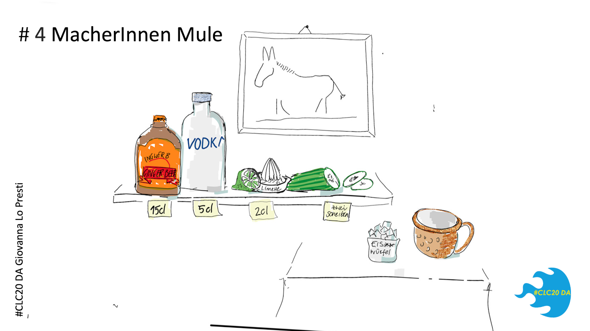

## Zwischen Herzblut und Hashtags -- von #lonelylearning zu #CLCFour

*Autorin: [Giovanna Lo Presti](https://www.linkedin.com/in/giovanna-lo-presti-cpcc/)*

Es gibt für alles ein erstes Mal, und dafür gibt es einen perfekten
Experimentierraum, die Corporate Learning Community. Genau darum soll es
im Folgenden gehen: meine ersten Male in der CLC 2017-2025 bzw. meine
Community-Moments, die meine Begeisterung und den Antrieb befeuern,
gemeinsam zu wirken und den Raum zu halten, für die Weiterentwicklung
unserer Lern- & Wissensgemeinschaft #sharingiscaring.

### Mein erster Hinweis. 2017 -- die große Quengelei oder #lonelylearning

Es könnte so 2017 gewesen sein, als ein findiger Vertriebler eines
aufstrebenden Online-Learning-Providers in Offenbach am Kaiserlei mit
mir in der Hochglanzlobby zusammensitzt und plaudert -- nachdem die
Sales-Themen vom Tisch sind. Es geht um L&D-Trends, und ich finde es
mehr als blöd, dass mein Horizont mindestens nur bis zur
Schreibtischkante und maximal bis zum Headquarter in Korea geht. Bis zu
diesem Tag habe ich also keinen blassen Dunst davon, was außerhalb des
Hyundai-Universums so abgeht. Ich habe wenig Ahnung von der großen
weiten L&D-Welt da draußen, kenne höchstens noch ein paar
Fachzeitschriften. Was ist eigentlich state of the art, was machen
eigentlich die anderen so ... ich bin quengelig, das Rad neu erfinden zu
sollen und irgendwie ohne Anschluss an die Welt da draußen. Kurzum, ich
bin so etwas wie ein lonely learner und ein lonely teacher in
Personalunion, und während ich meine Situation so an Christian Büttner
von GoodHabitz referiere, sagte er den magischen Satz: Kennst du
eigentlich die Corporate Learning Community?! Wir sind da Sponsor und
ich kann dir den Kontakt vermitteln. Oha! Ich habe alle Antennen auf
Empfang!

Randnotiz: die Learning Library von GoodHabitz pilotiere ich, bevor ich
absagen muss, um beim Marktriesen einzukaufen. Der Kontakt bleibt und
Fortsetzung folgt.

Schon damals sitze ich in der Nähe meiner künftigen WOL-Circler und
CLCFour und habe noch keinen Schimmer ... auch spätere Kernteamler und
Orgateam-Mitglieder entdecke ich, bin aber nicht ganz sicher, bist du
es? Sitze ich da hinter Katrin? Ist das hinter mir Anja? Ist das der
ganz hinten Carlo? Tja ... (Quelle: colearn.de)

### Mein erstes CLC-Barcamp -- #CLC18 

... findet auf dem Unicampus in Kassel statt. Das Thema: „Lernwelten der
Zukunft". Schon am Eingang pralle ich am Ende der Schlange ab und lerne
Sarah Basniak kennen. Ich sehe zum ersten Mal Charlotte Venema,
Karlheinz Pape, Simon Dückert ... Der Spirit steckt mich an. Die
nächsten zwei Tage sitze ich mit nahezu 300 Leuten in Sessions, lerne
Trainings ohne Agenda von Nadja Petrovskaja kennen, drehe selbst ein
kurzes Video. *Alles ist Erlebnis, Experimentierraum,
Erfahrungsaustausch.* Ich bin angezündet -- so ganz ohne Alkohol --
fast. Mein Gehirn ist gedüngt, ich höre zum ersten Mal den Begriff
"krasseherde". Von Simon bekomme ich später noch zwei gleichnamige
Aufkleber, von denen ich bis heute nur einen aufgeklebt habe und trinke
Killepitsch, Kräuterlikör. Wenn ich auf colearn.de stöbere -- eine wahre
Schatzkiste --, sehe ich auf Bildern viele Menschen, die ich später noch
besser kennenlerne und die schon damals tragende Säulen dieser
Gemeinschaft sind.

Auf dem Bahnsteig stehe ich später noch mit Stefan Diepolder, Julia Rack
und Steffi Halimi zusammen. Wir sind jetzt ein WOL -- Working Out
Loud-Circle und das ist schon der Beginn einer weiteren Lernreise, die
uns noch sehr verbinden wird!

Geflasht fahre ich nach Hause, neue Herde gefunden und einer Gruppe in
Xing beigetreten (was ist das?). Im April 2020 habe ich sie gegen die
LinkedIn Gruppe getauscht, die inzwischen mehr als 11.000 Mitglieder hat
und ich bin auf Twitter als \@Frau_Lo, heute nur noch als Observer und
Karteileiche. Ich schließe mich der Frankfurter Regio-Community an,
lerne Oliver Lorenz, Jochen Robes, Nicola Appel, Annette Sell und noch
mehr Menschen kennen, erfahre Lego Serious Play, mache mit -- ich bin so
was von dabei und habe das Gefühl, hier bin ich richtig. Der Rest ist
Hamburg, Koblenz, Online und hybrid,-- mein erster Promptathon -- und
jüngst #CLC25 in Hamburg.

### Meine erste CLC Kollegin -- 2019 bei Segula in Rüsselsheim 

Einer dieser Abende in der Frankfurter CLC-Community. Ich bin inzwischen
Head of L&D eines Unternehmens, dass das Entwicklungszentrum von Opel
übernimmt, um es für neue Automobilhersteller zu öffnen. Das erfordert
Aufbauarbeit des neuen Standortes, der Infrastruktur und Recruiting mit
Betriebsübergang. Ich darf als Head of L&D alles mit aufbauen, auch mein
Team. Ich suche Mitstreiter. Angebot und Nachfrage treffen in der
regionalen Community #clc069 zusammen. Erstmal lose und mal sehen. Dann
hat Annette es tatsächlich gewagt, obwohl auf dem Weg zum Gespräch in
ganz Rüsselsheim Schilder hingen, die eher zum Weglaufen einluden:
Segula raus. Wir bleiben Opel. Fortan sind Annette und ich ein Team plus
ein Werkstudi auf der wahrhaft grünen Wiese.

Wir -- und besonders Annette als „Head of Hub" -- haben das Intranet
bzw. Enterprise Social Network -- ESN -- belebt, den Community-Gedanken
befeuert, eine Lernkampagne gestartet, Compliance-Trainings eingeführt,
Online-Trainings und die Leadership-Konferenz sowie den Day One auf die
Beine gestellt und nebenbei noch die Opel-Leute herbei rekrutiert. Also
einmal alles.

Bevor ich der französischen Muttergesellschaft ein LMS vorschlage,
horchen wir in die CLC und erhalten als Echo Hilfsbereitschaft, Tipps
und Erfahrung -- priceless. Wir finden die perfekte Lösung. Finden wir.
Meine LMS-Ideen, der Umsetzungswille und ich beschäftigen die Firma noch
eine Weile, dann canceln sie das LMS-Projekt und meine Stelle und die
meines Vorgesetzten gleich mit. Zum Glück werde ich auf einer Welle der
Wertschätzung dort herausgetragen und ich werde nie vergessen, wie mich
sogar die Empfangsdame noch herzlichst umarmt. Seitdem habe ich eine
Rechtsschutzversicherung. Annette bleibt noch ein bisschen und
mindestens bei allem, das mit „Sell" anfängt, denke ich jetzt an sie --
und bei Fleischwurst und Lyoner und bei dem Spruch, „die Welt ist ein
Taschentuch". Ironischerweise arbeite ich später in der Lyoner Straße in
Frankfurt.

Randnotiz: Ich habe damals mal wieder bei GoodHabitz angerufen und ein
Angebot angefordert und mich beeilt dazuzusagen, dass es schon genehmigt
ist. Wir haben direkt die Online Library implementiert, mit
Unterstützung der super Lerncoachin Julia, die ich aus meinem ersten
WOL-Circle kenne und so gerne mit ihr arbeite. So kreuzen wir im Laufe
der Zeit Lebensläufe und Karrieren.

### Mein erstes Mal im Orgateam -- 2020/ Pandemie #CLC20 DA, hosted by Merck in Darmstadt

Es ist ein unfreiwilliges Online- statt einem Hybrid-Barcamp. Karlheinz
kann auf eine besonders ruhige Art sehr überzeugend sein, wenn Hände für
das Orgateam gebraucht werden. Wir planen zunächst mit dem Merck
Innovation Center und können es dann doch nur virtuell betreten.
Pandemie-Power im Orgateam. Mein Aufgabenschwerpunkt ist Marketing, und
ich poste auch auf LinkedIn regelmäßig Voices aus der Community.

Aus den Marketingaktivitäten entsteht ein kleines Interview-Video mit
Karlheinz, das einen Waldspaziergang simuliert. Ich bin heute
nachsichtig mit meinem damaligen Ich, denn ich habe viel gelernt. Der
Ton ist mies, das Bild mittelmies, im Gegensatz zu den Antworten von
Karlheinz, der wie immer ruhig, geduldig und klar spricht.

Inhaltlich gibt er einen kurzen Einblick in die Anfänge bei der CLC, die
aus regelmäßigen Treffen von Trainingscenterleitern der Hessenmetall ab
2007 entstanden sind. Das erste Camp organisieren Charlotte und
Karlheinz bereits 2011. Inzwischen reichen die Aktivitäten über die
ganze DACH-Region. Die CLC hat sich vorgenommen, Lernen in
Organisationen grundlegend zu verändern, und zwar hin zu mehr
selbstgesteuertem Lernen. Als Netzwerk lebt die CLC immer von der
Aktivität der Mitglieder, und deren großes Engagement lässt sich unter
anderem auch an den derzeit 17 Regiocommunities ablesen. Gleichzeitig
sind wir auch ein Experimentierraum, das prägt Kompetenz aus und gibt z.
B. Sicherheit vor der Implementierung im Unternehmen. Für die Gestaltung
der Lernräume hat die Pandemie die Erkenntnis beschleunigt, dass
Online-Formate sehr wohl funktionieren und auch Vorteile mit sich
bringen, wie z.B. asynchrones Arbeiten.

### Visualisierung 

... ist das Thema der Stunde beim Barcamp in Darmstadt 2020. Viele
Sessions sind als Sketchnote dokumentiert -- und natürlich gab es auch
eine Session von Karl Damke und Simon Dückert zu Sketchnote-Basics --
der lernOS-Leitfaden Sketchnoting ist, neben vielen anderen wertvollen
lernOS-Themen, online über die lernos.org Seite verfügbar. Die
Cocktailkarte für Barcamper und Drin(k)fluencer für das virtuelle
Abendevent, das ich an meinem iPad gescribbelt habe, hat mir einen
Heidenspaß gemacht. Learn on the beach und der MacherInnenMule, der
Whiteboard Russian oder der Sketchnote Sour sind ganz mein Ding.

 

### Meine erste Keynote -- L&Dpro in München 2021

Ich weiß nicht mehr, wie-warum-weshalb mir damals Monika Schädel vom HRM
Institut in Mannheim anbietet, eine Keynote auf der L&Dpro zu halten.
Ich habe einfach zugesagt. Wen treffe ich in München beim
Vorabend-Dinner im Restaurant „Der Dantler" unter anderem: Karlheinz und
Simon! Ich habe lange an meiner Keynote gearbeitet mit dem Titel „Lead
like liquid", in der Wasser als Metapher für Leadership steht und
insgesamt 10 Eigenschaften abbildet und ich stehe voll dahinter, doch
jetzt geht mir doch ganz schön die Düse. „Wenn Caren Miosga von Karten
ablesen kann, dann darfst du das auch!", sagte Simon zu mir auf dem Weg
zum Hotel. So freaking true! Den Satz habe ich mir gemerkt. Danke dafür.
Den brauche ich hin und wieder. Nach meiner Keynote bin ich zum
CLC-Stand bei Karlheinz und Simon auf der CLC-Homebase „eingekehrt", wo
ich auch Oliver Ewinger traf, mit dem ich viel gute Zeit dort verbracht
habe.

Das Jahr darauf habe ich dort das erste Zusammentreffen meines neuen
Teams bei der PAYONE geplant und sie mit der Barcamp-Area vertraut
gemacht. Sie finden das nett, und ich bin ein bisschen enttäuscht, dass
es nicht wahnsinnig zoom-peng-klack-boing gemacht hat. Aber klar, wir
haben ja kein Barcamp besucht, sondern eine Messe.

Wenn ich jetzt den Job wechsle, treffe ich sie hoffentlich künftig in
der Regio-Community #clc069.

### Mein erster lernOS Leitfaden -- 2021plus

Ende 2021. Irgendwie habe ich in meinem neuen Job das Gefühl, ich
brauche mal einen Circle zu Leadership. Felix Harling hat den gleichen
Gedankengang und plant einen Circle zum Thema -- zack -- bin ich im
Autorenteam mit am Ende sieben anderen. Mein erstes Projekt mit Pivi,
die z.B. schon den Diversity lernOS-Leitfaden geschrieben hat. Auch
Marianne kenne ich aus dem Orgateam. Die anderen Mitautorinnen Sara,
Dörte, Johanna und Claudia kenne ich lange nur online, Claudia erkennt
mich ein Jahr später auf der Copetri. Eine Reise, eine Erfahrung.
Pilotphase mit ca. 90 Leuten über LinkedIn in 2022 und jede Menge
Resonanz und Rückmeldung zwischen Impfarmen und Lektorat, einer Lunch &
Learn-Session und Abschluss des Piloten Ende April.

Das bringt mir einen Podcast-Termin bei Unboxing Agile mit Daniel Räder
zum Thema Peerlearning ein. Mit Sara Parr mache ich später einen
Tandem-Piloten, das verbindet uns.

Gegen Ende und nach dem Piloten hängen wir ein bisschen durch mit
unserem Projekt, manchmal kommt das Leben dazwischen: Umzug, Sabbatical,
Jobwechsel, Corona, ein paar Klippen, die wir noch umschiffen, z. B.
eine namens Github, dann ist das Ding online. Dank tatkräftiger
Unterstützung von Simon und dem langen Atem von Felix, wenn es um die
Finalisierung beim Hochladen 2023 geht. Eins ist klar, bei so einem
Projekt entsteht viel mehr als nur ein Guide. Später habe ich den
Leitfaden als Basis für meinen Leadership Circle bei PAYONE herangezogen
und mir ein wenig zurechtgezupft -- Corporate Peerlearning, das ist eine
andere Session. Beim nächsten Camp? Wer hat Interesse? Es ist auch eine
Keynote und ein gemeinsamer Vortrag mit Herwig in 2025 und das hängt
hiermit zusammen:

### Mein erster „offizieller" Posten -- 2025

Eine Mail von Karlheinz, 11.11.2024. Beim zweiten Mal hinsehen: ist ja
gar kein Newsletter, ich soll ihn zurückrufen. Äh, ich, ach, oha!
Karlheinz organisiert seine Nachfolge, es soll ein Viererteam sein, drei
sind schon nominiert. Wir telefonieren, wir sollen uns zu viert treffen,
mal sehen, ob wir uns grün sind. Sind wir. Ich stecke schon wieder in so
einer Art Abenteuer habe ich den Eindruck, kann mir bitte jemand eine
To-do-Liste zustecken?! Das Barcamp rollt schon an, es gilt trust the
process. CLCFour, wir treffen uns in Frankfurt bei der PAYONE zum
CLCFour-Kickoff. Herwig kommt aus Österreich, Harald aus Bayern und
Martin aus der Schweiz. Kein Geruckel, wir fangen einfach an, gemeinsam
machen wir uns auf den Weg. Ich fühle mich in bester Gesellschaft mit
diesen Weggefährten. Ab jetzt treffen wir uns jedes Jahr woanders und
wir sind wöchentlich im Kontakt -- und wir haben zu tun. Wir bekommen
von Silvia und Simon ein Expert-Debrief von Karlheinz. Harald hebt uns
auf die Nextcloud. Wir gehen zum Notar.

Bereits rückwirkend zum 1.7.2025 sind Harald Schirmer und ich offizielle
Geschäftsführer der Corporate Learning Community gUG und Herwig Kummer
und Martin Geisenhainer sind neue Gesellschafter der gUG und übernehmen
damit Karlheinzs und Charlottes Anteile. Wir sind die CLCFour. We hold
the space, und wir arbeiten mit Kernteam und Gesellschaftern -- und
allen, die #einfachmachen und #bescheidsagen.

Am 28.8.2025 erfolgt der Handelsregistereintrag am Registergericht
Frankfurt. An meinem Geburtstag macht die Notarin den Eingangsstempel
drauf, kann ja nur gut werden.

Mitte Juli. Eben waren wir noch bei der Notarin in Nürnberg, Karlheinz
und ich, wir haben noch ein bisschen wertvolle Zeit verbracht. Leider
konnte Harald nicht am gleichen Tag dabei sein (Quelle: Giovanna Lo
Presti)

Es ist schon August 2025, wenn ich das schreibe: Die Strategie, die wir
finalisieren, der Draft von Harald, in den die CLCFour-Überlegungen, die
Ergebnisse aus den Zukunftskonferenzen, dem Barcamp mit eingeflossen
sind, die Abstimmungen mit dem Kernteam und die Absicht, neue
Zielgruppen zu erschließen und uns dafür auch ein bisschen frischer zu
präsentieren -- ein Fresh-up, man würde sagen, ein bisschen Wangenrot?
Kein Botox, nur ein sanftes Peeling. Daran arbeiten wir und ich freu
mich schon. Stay curious -- kann man das heute noch schreiben oder ist
das schon cringe?

### Mein erstes Barcamp als CLCFour: Hamburg -- #CLC25 im März 

„Mehr Intelligenz ins Lernen" ist das Motto 2025 an der beruflichen
Hochschule in Hamburg. Vor allem ist es das vermutlich letzte Barcamp
mit Karlheinz. Die CLCFour und er -- das bedeutet eine Veränderung.
Abschied und Aufbruch. Jetzt ist es für alle sichtbar. Karlheinz
verabschiedet sich, wir alle verabschieden ihn mit standing ovations.
Die können gar nicht lang genug sein. Der Wegbereiter, Ermutiger und
Vormacher übergibt an uns, die Weitermacher. Und wenn hier kein weiteres
Loblied auf ihn folgt, dann, weil es bereits eines gibt, der Platz nicht
reicht und meine Worte vermutlich auch nicht.

##Thefutureisnow. Auf dem Barcamp in Hamburg gab es, neben KI-Input auch
Sessions wie „TikTok trifft Tageszeitung" von Eleonora. Wie lernen die
jüngeren Zielgruppen, wie funktionieren die, wo sind sie zu erreichen?
Kritisch schauen wir uns um und an, betrachten die Haarfarben. Wir
überlegen, wie müssen sich Lernangebote verändern und was macht uns als
Community attraktiv für junge Personalentwickler und alle, die mit
Corporate Learning zu tun haben? Nur Format & Relevanz? Die Session, quo
vadis CLC hat die Komplexität der Ergebnisse der Zukunftskonferenzen
noch einmal zutage gefördert: Nicht auf einen Blick erfassbar, aber auch
hier ist klar, Verjüngung und Zukunft sind verzahnt. Es gibt viel zu tun
\... und jeder darf, kann, soll, der will.

Ist ja auch logisch, Gen Z, Alpha Beta etc. ist nach den ersten zwei
Minuten des Filmklassikers „Spiel mir das Lied vom Tod" garantiert auch
zu Tode gelangweilt. Schnellere Einstellungen, schnellere Schnitte,
schnellere Info auf den Punkt gilt für fiktionale und non-fiktionale
Formate. Seh- und Lerngewohnheiten, Hirne verändern sich, und damit
neuronale Trampelpfade auch. Naja, andere Session.

Dieses Barcamp ist: voll -- voller Sessions, Begegnungen,
Wiedersehensfreude, Emotionen und gutem Essen. Endlich wieder ein echtes
Camp mit vielen Menschen vor Ort und online. In Hamburg hat Jochen auch
die Session zur Buch-Idee gepitcht.

In meine Richtung fallen am ersten Tag Sätze wie, „Fühl dich nicht als
Quotenfrau", und „Wir fühlen uns von dir gut vertreten", das hat mich
berührt. Ich bin froh, dass die CLCFour nicht den Text mit den alten
weißen Männern hören muss.

Am zweiten Tag fahre ich schweren Herzens zurück und bin online dabei,
weil ich die kollegiale Fallberatung nicht im Zug moderieren will.
Begeistert von der hybriden Technik. Hut ab. Ehrlich. Die beste hybride
Veranstaltung ever -- neben der loscon.

Danke auch Nordmetall. Danke Henning, für's Hosten und die super
Moderation, danke an das großartige Orgateam auch für die tolle
Fluglotsen-Idee, die mein Hirn immer wieder zutage fördert, wenn jemand
fragt, „wo ist ...". Film und Hut ab.

Wir werden noch viele gute Ideen umsetzen, wir alle. Abseits von Rollen,
jede einzelne Person, die sich engagiert und sichtbar wird. Das ist
unschätzbar substanziell, #machhalt. Ich bin dankbar für die tollen
Leute, auf die ich hier treffe. Und wir, die vier, haben unsere Arbeit
aufgenommen. Ehrenamt, Hintergrunddienst. Oder Dugnad würde Anders
Indset sagen, der mich bei einem Vortrag sehr beeindruckt hat und mir
vorne in sein Buch, Der Wikinger Kodex, schrieb: hej Giovanna, bereit
für den Dugnad? Offenbar. Auch wenn das ohne Ehre und ohne Amt ist und
alle mitmachen.

Randnotiz: Dugnad ist eine norwegische Tradition, gemeinschaftlich,
freiwillig, zum Wohle aller bzw. einer Gruppe oder Person. Anders Indset
bezeichnet es als Ehrenamt ohne Ehre und ohne Amt, z.B. in seinem Buch,
„Der Wikinger Kodex".

### Und jetzt? Ein erstes Inspire & Network mit Oliver 

... und die Freude auf alles, was da kommt. Eine Keynote und dann noch
eine. Ich teile alles, was ich weiß und kann. Egal ob Messen,
Conventions, Camps, es geht um Menschen und um relevante Inhalte, alles
ist Lernen #everythingwedowelearn. Als Social Animal sind Netzwerke,
Wissen und Neugier mein Treibstoff, den trage ich in meinen Job -- auch
in Form von Büchern, wie neulich „Lernmythen aufgedeckt" von Yvonne
Konstanze Behnke, der ich auf der LEARNTEC über den Weg gelaufen bin,
habe ich mir gleich besorgt und es nicht bereut.

Und die Moral von der Geschicht' ... nicht Netzwerken lohnt sich nicht.
Zusammen geht es besser. Ich fühle mich gut vernetzt. Diese starke
Community gibt mir Energie, Sicherheit und mehr Selbstbewusstsein weil
ich immer weiß, ich habe mehr als einen Telefonjoker und wir helfen und
unterstützen uns gegenseitig. Das liebe ich. Dafür setze ich mich ein.
Dann ist es o. k., als Individuum nicht alles wissen zu können und nicht
überall dabei zu sein. Das habe ich mir inzwischen abgeschminkt. FOMO
auch. Ich mach einfach.

Ich bin dankbar für gestern und zuversichtlich für morgen.

\#everythingwedowelearn \#nolonelylearners \#heimatCommunity \#CLCFour
\#dieweltisteintaschentuch \#lernenliebtwissen \#neugieristmeintreibstoff
\#macheinfach-undsagbescheid

