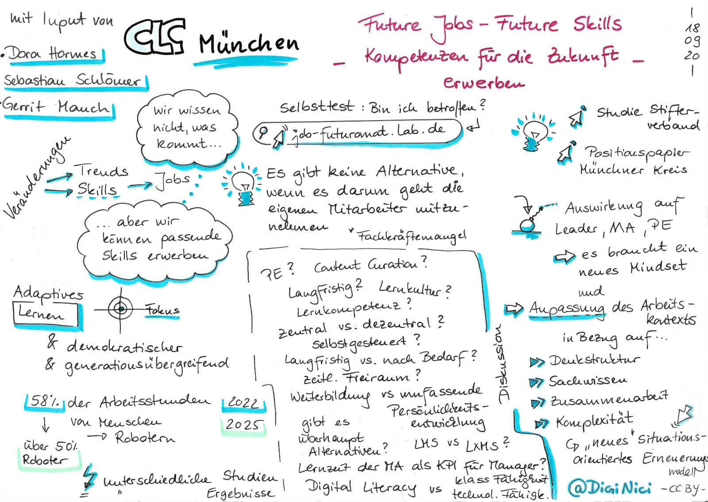
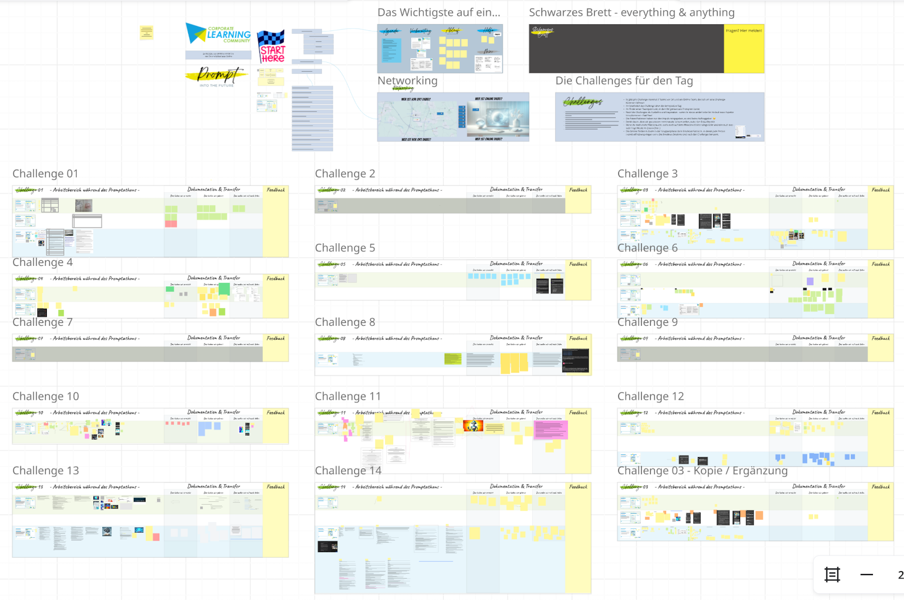

## CLC - Dünger für mein Hirn

*Autorin: [Nicole Denzel](https://www.linkedin.com/in/nicoledenzel/)*

Wenn vom Begriff Community oder Gemeinschaft gesprochen wird, denken
viele zunächst an Mitgliedschaften und etwas Verbindliches -- vielleicht
sogar an geheime Rituale oder Abzeichen. Doch um es gleich
vorwegzunehmen: An der Corporate Learning Community (CLC) ist nichts
Geheimnisvolles und nichts Mystisches. Im Gegenteil: die Community ist
das Ergebnis von Energie und Engagement vieler Menschen, die an
unterschiedlichsten Stellen aktiv sind. Die CLC ist bunt, vielfältig und
hat sich, wie ihre Mitglieder, im Laufe der Zeit gewandelt.

Erst durch die Einladung, einen persönlichen Beitrag zu verfassen, wurde
mir wirklich bewusst, wie lange ich schon Teil der CLC bin -- und wie
sich mein Zugehörigkeitsgefühl von „hilfreiches Netzwerk, da schaue ich
ab und zu rein" zu „Ich gehöre dazu" verändert hat. Mein Einstieg in die
Corporate Learning Community war nicht durch einen einzigen großen
Aha-Moment geprägt, sondern durch viele kleine, nachhaltige Begegnungen.

### Mein erstes Barcamp in Frankfurt

2017 stieß ich erstmals auf einen MOOCathon der CLC, in dem jede Woche
ein anderes Unternehmen vorbereitet hatte, wie sie Lernen verstehen. Zu
der Zeit arbeitete ich in einer Firma mit etwa 70 Kolleg\*innen und
hatte oft das Gefühl, mit meinem Hunger auf lebenslanges Lernen alleine
dazustehen. Doch plötzlich hatte ich zwei bis drei Mal pro Woche die
Möglichkeit zu sehen, „wie es andere machen". Es gab digitalen Austausch
in Live-Terminen, vertiefende Diskussionen in Foren und viele Dokumente
wurden bereitwillig zur Verfügung gestellt. Alles auf Augenhöhe und über
Unternehmensgrenzen hinweg. Eine ganz neue Welt für mich!

Beim gemeinsamen Barcamp in Frankfurt wurden die digitalen Kontakte dann
plötzlich physisch greifbar und es öffnete sich mir die Tür zu einem
Netzwerk Gleichgesinnter. Ich kann mich heute noch an den großen Raum
voller Menschen erinnern, bei der mir schon nach der halben
Vorstellungsrunde der Kopf schwirrte. Es gab keine Agenda und doch hatte
ich nach dem Einsammeln der Sessionvorschläge schon das erste Mal FOMO
(Fear of missing out), weil so viel Interessantes gleichzeitig
stattfand.

Von den Personen, die anwesend waren, hatten sich viele bis zu dem
Zeitpunkt nur digital getroffen und trotzdem entstand ein
Gemeinschaftsgefühl -- eine „krasse Herde". Bei der Rückfahrt wurde mir
klar, dass mich nicht nur die verschiedenen Berufe und Hintergründe
angesprochen hatten, sondern vor allem (und bis heute) das verbindende
Element „Lernen" und ein wertschätzender, interessierter Umgang. In der
CLC geht es für mich nicht um oberflächliches Netzwerken oder
Visitenkartentausch, sondern um ehrliches, neugieriges Interesse am
Gegenüber.

Frankfurt war für mich der Türöffner in die CLC und auch Monate nach
diesem (und den folgenden) Barcamps erinnere ich mich immer wieder an
Sessions, die mir neue Perspektiven eröffnet oder Gesprächskontakte für
meinen Arbeitsalltag geliefert haben.

### Wandel, Klassentreffen und langjährige Wegbegleiter\*innen 

Auf das Barcamp in Frankfurt folgten fast jedes Jahr meist zwei weitere
Barcamps -- ob vor Ort oder Online, in Hamburg, Koblenz oder Walldorf --
immer war das Lernbuffet prall gefüllt. Und nach zunächst schüchternem
Mitmachen habe ich nach und nach immer mehr Menschen kennen- und
schätzen gelernt. Die Vision 2025 haben wir längst schon eingeholt und
trotzdem sind wir immer noch nicht am Ende angekommen (zum Glück).

CLC-Veranstaltungen fühlen sich für mich heute an wie Alumni-Treffen:
viele bekannte Gesichter, kombiniert mit neuen Begegnungen, während
gesetzte und Hype-Themen durch die CLC Bubble wandern. Ich kann viele
Personen nicht nur zuordnen, sondern kenne auch ihre Expertisen,
Erfahrungen und Entwicklungen: eine sich bewegende Gemeinschaft.

Im Laufe der Jahre habe ich selbst auch verschiedene berufliche
Stationen durchlaufen. Doch ganz gleich, ob ich als Inhouse-Beraterin
tätig war, ein Lernmanagement-System eingeführt, im Produktmanagement
gearbeitet oder mich mit Themen wie Virtual Reality und Künstlicher
Intelligenz befasst habe -- eines hat sich stets bewährt: In der CLC
finde ich immer Menschen, die sich mit ähnlichen Fragestellungen
auseinandersetzen und die ich unkompliziert ansprechen kann. Auf diesen
wertvollen, unterstützenden Austausch konnte ich mich jederzeit
verlassen.

### Peer Learning at it's Best

Mit dem Aufkommen von Methoden wie Working Out Loud oder lernOS in der
CLC war ich schließlich komplett angekommen und (im positiven Sinne) so
verwoben, dass ich nicht mehr weg wollte. Begegnungen gab es
mittlerweile häufig: auf den Barcamps, der re:publica, beim Pub-Quiz
oder in digitalen CoWorking-Sessions während der Pandemie, beim
digitalen Gärtnern, auf der Learntec, beim Promptathon oder bei
regionalen Stammtischen... die Vielfalt der Formate und Methoden, die
wir gemeinsam ausprobiert haben, ist einfach nur bereichernd. Das zeigt
sich auch in einigen der Sketchnotes, die ich aus meinem Archiv gekramt
habe und gerne als „Sharing-Momente" hinzufüge.

Gepaart mit Peer Learning, dem gegenseitigen Anstacheln, Mittragen und
voneinander Lernen -- ist für mich die CLC ein komplettes Konzept. So
vielfältig die Menschen auch sind, die Offenheit und das Interesse
aneinander bleiben konstant: In der CLC zählt nicht der Lebenslauf,
sondern was wir gemeinsam teilen -- Ideen, Neugier und die Lust am
Lernen. Dabei zu sein, mitzuwirken und auch selbst ansprechbar zu sein
ist das, was mich im beruflichen Alltag stärkt!

Zusätzlich habe ich erlebt und mittlerweile verinnerlicht: mit den
richtigen Menschen zuerst online zusammenarbeiten und sie erst im
Nachgang persönlich treffen... das geht!

Wenn wir authentisch in den Austausch gehen, sind unsere
Persönlichkeiten in jedem Format spürbar... dann ist das persönliche
(physische) Treffen nur noch die Bestätigung, dass es einfach passt.

### Ausblick: Mein Wunsch für die Zukunft der CLC 

Lange habe ich überlegt, ob ich einzelne Menschen namentlich nennen
soll, die ich mit der CLC besonders verbinde. Ich habe mich bewusst
dagegen entschieden -- aus dem einfachen Grund, dass der Beitrag niemals
ausreichen könnte, wirklich allen gerecht zu werden und ich vermutlich
die nächsten Tage damit verbringe, noch einen Namen mehr „hinterher" zu
liefern.

Das stimmt mich vor allem dankbar, weswegen ich es umdrehe und DICH
direkt ansprechen möchte: Danke, dass DU (wenn wir uns kennen) Teil
meiner CLC-Reise bist oder warst, und dich mit mir an so viele
Erlebnisse erinnerst. Und selbst wenn wir uns noch nicht persönlich
getroffen haben: Danke, dass du Teil der CLC-Vielfalt bist und unsere
Gemeinschaft durch deine Erfahrung bereicherst!

Daraus ergibt sich mein größter Wunsch für die CLC: Dass wir auch in
Zukunft eine aktive Community aus engagierten Professionals bleiben --
eine Gemeinschaft, die vom Mitmachen lebt. Lesen ist wichtig, und
natürlich kann nicht jede\*r immer überall dabei sein. Aber diese
Gemeinschaft lebt davon, dass wir uns nicht nur beschenken lassen,
sondern auch aktiv beitragen.

### Mein persönliches Fazit

Für mich ist die CLC ein elementarer Bestandteil meines beruflichen
Lebens geworden -- ein „Ort", der mich durch unterschiedliche Stationen
und wechselnde Aufgaben begleitet hat. Ich wünsche mir, dass die
Community weiterhin mutig, offen und neugierig bleibt. Mein größter
Wunsch: Dass jede\*r, der neu zu uns stößt, dieses besondere Vertrauen,
diese Offenheit und Unterstützung spüren kann -- so wie ich es erlebe.
Schenkt der Community und den Projekten das Grundvertrauen, dass es euch
weiterbringt. Denn eines habe ich gelernt: ich weiß nie, wann ich etwas
aus unserem Austausch wieder verwenden kann, aber ich bin sicher, dass
es so sein wird.

Allen, die diese Community gestalten -- sichtbar und unsichtbar: Danke!

Ihr habt geholfen, meine Lernbatterien immer wieder aufzuladen.

Und frei nach einem Spruch von Karlheinz Pape: „Die Corporate Learning
Community ist (für mich) Dünger für mein Hirn - und mein Herz."
