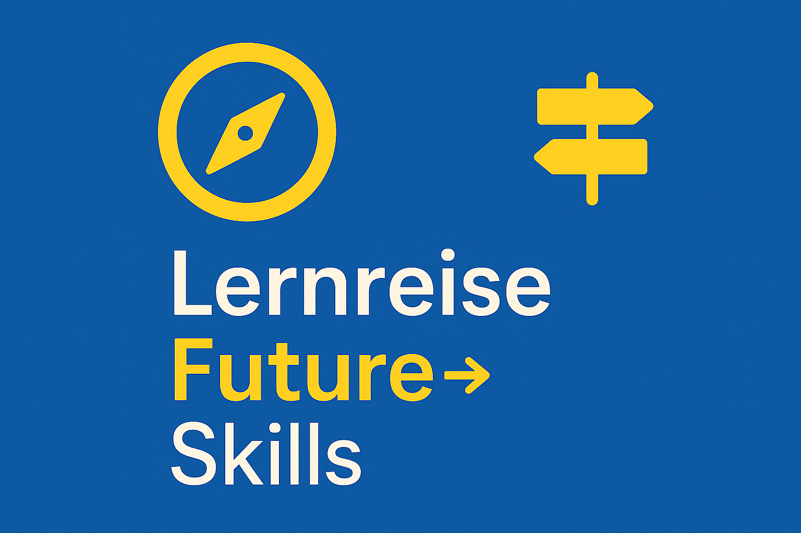

## Future Skills: Eine Lernreise zwischen Hype und Haltung

*Autor:innen: [Anja C. Wagner](https://www.linkedin.com/in/acwagner/), [Joachim Niemeier](https://www.linkedin.com/in/joachimniemeier/)*

### Wie wir uns wirklich auf die KI-Ära vorbereiten

Was unterscheidet erfolgreiche Unternehmen
von jenen, die im digitalen Zeitalter zurückfallen? Es sind nicht nur
innovative Produkte oder moderne Technologien, sondern vor allem die
Fähigkeit, sich kontinuierlich neue Kompetenzen anzueignen -- die
sogenannten Future Skills. „Future Skills" hat sich entsprechend zum
Schlagwort entwickelt. Es klingt nach Fortschritt und Sicherheit. Doch
was steckt dahinter? Sind es die Schlüsselkompetenzen von morgen oder
nur eine glänzende Fassade? Wie wollen wir in Zukunft arbeiten, führen,
lernen?

Seit 2024 organisieren wir, Anja und Joachim, eine „Future
Skills"-Talkreihe der CLC. Wir untersuchen, welche Kompetenzen
Bildungseinrichtungen und Unternehmen zukunftsfähig machen. Gerade
jetzt, da sich die Arbeitswelt stark verändert, ist es wichtig, die
Tiefe dieses Themas zu ergründen. Die Talkreihe soll Corporate Learning
Professionals praxisnahe Lernstrategien bieten -- modern, pragmatisch
und entspannt.

Für die Talkreihe haben wir das Lunch&Learn-Format gewählt. Es fördert
informellen Wissensaustausch und ist kurz und direkt. Wissen fließt
schnell und unkompliziert, ob von internen oder externen Expert\*innen.
Das Ergebnis? Ein kollektiver Wissensraum, der unsere Learning Community
stärkt. So können wir vielfältige Themen kritisch beleuchten und
Antworten suchen, die über das Offensichtliche hinausgehen.

### Der Mythos von den vier Säulen: Wissen, Persönlichkeit, Soziales, Methoden -- Reicht das wirklich? 

In unserer Auftakt-Session skizzierte Anja die vier fundamentalen Säulen
der Future Skills: Wissen, Persönlichkeitsstruktur, soziale Fertigkeiten
und methodische Kompetenzen. Diese Einteilung soll Orientierung bieten.
 Doch unsere Lernreise zeigte
schnell: Die Landkarte mag klar sein, der Weg ist steinig und voller
Fallstricke. Reden wir nur über diese Säulen, oder bauen wir sie auch
konsequent auf?

Deutschland hinkt bei der Weiterbildungsbereitschaft im europäischen
Vergleich hinterher. Es mangelt an gesellschaftlicher Ambition, und
kulturelle Barrieren wie „Arroganz gegenüber neuen Technologien" bremsen
uns aus. Kompetenzmodelle veralten schnell, und
Persönlichkeitsentwicklung lässt sich schwer in formalen Bildungsräumen
verankern. Wenn Menschen sich nicht aktiv weiterbilden, droht ihnen die
Abkopplung vom Arbeitsmarkt und der gesellschaftlichen Entwicklung. Sind
wir bereit, diese unbequemen Wahrheiten anzuerkennen?

### KI als Heilsbringerin oder trügerische Dialogpartnerin? 

Künstliche Intelligenz treibt viele Veränderungen voran. Sie soll unser
Lernen „schneller, tiefer und individueller" machen. Werner Sauter und
Daniel Stoller-Schai stellten den „Dreiklang des Lernens" vor: Lernen
mit sich selbst, mit KI und mit anderen.
 Die KI wird zur „neuen
Lernpartnerin". Doch unsere Diskussionen im CLC Lunch&Learn zeigten auch
kritische Zwischentöne. Eine Teilnehmerin fragte: „KI kann auf
Spracheingaben reagieren -- aber ist das ein Dialog im humanistischen
Sinne?"

Wir müssen die Gefahr der Vermenschlichung ernst nehmen: Die KI mag
Antworten liefern, aber sie denkt nicht empathisch oder aus eigener
Motivation. Wird der kritische Geist nicht abtrainiert, wenn wir der KI
die „Denkarbeit" überlassen? Die Befürchtung, dass KI zu einer
„didaktischen Bevormundung" führen könnte, wurde deutlich geäußert. Im
AI-Lab der CLC haben wir im Winter 2024/25 experimentiert, wie KI als
Kooperationspartnerin genutzt werden kann.

Doch selbst hier bleibt die
Herausforderung der Quellentransparenz und des richtigen „Systemprompts"
bestehen. Es geht nicht darum, ob KI eingesetzt wird, sondern wie -- und
ob sie uns zum Denken anregt oder davon entlastet.

### Studienergebnisse, die den Horizont erweitern 

Die Vorstellung von Studienergebnissen im Rahmen des CLC Lunch&Learn ist
kein trockener Befund -- sie sind Treibstoff für unsere Lernreise. Sie
zeigen neue Wege, öffnen Perspektiven und geben den Impuls, mutig
weiterzudenken. Martin Lindner stellte die Ergebnisse der Studie „Future
Skills für eine von KI beeinflusste Lebens- und Arbeitswelt" vor.

Die Studie verdeutlicht: Im
KI-Zeitalter sind ausgewogene Kompetenzen in sozialen, technischen und
individuellen Bereichen entscheidend. Besonders relevant ist der Ausbau
von Souveränität und Zusammenarbeit im Umgang mit KI.

Thomas Tillmann stellte die Ergebnisse einer Studie zum Einsatz von
Künstlicher Intelligenz (KI) im Bereich Learning & Development (L&D)
vor.  KI im L&D-Bereich birgt enorme
Chancen, stellt aber auch Herausforderungen dar. Es geht nicht nur um
Effizienz, sondern um ein grundlegendes Umdenken in Lernprozessen und
die Gestaltung zukunftsfähiger Lernwelten. Eine frühzeitige
Auseinandersetzung mit KI-Skills wie Prompt Engineering macht fit für
die Zukunft.

Die Studie „Weiterbildung 2024" beleuchtete den gegenwärtigen Trend,
dass KI Treiber für individualisierte und effiziente
Weiterbildungsformate ist. Katherina Peet und Johanna Voigt machten
deutlich, dass sich die Weiterbildungslandschaft im Wandel befindet: KI
eröffnet neue Möglichkeiten, Lernen zu personalisieren und effizienter
zu gestalten.\
 Der persönliche Austausch
bleibt jedoch weiterhin von zentraler Bedeutung. Ohne Kultur, ohne
Austausch bleibt Technik leer. Der Einsatz von KI allein reicht also
nicht aus -- für eine echte Wirkung braucht es eine starke, positive
Lernkultur in den Unternehmen.

### Regulierungswut und Innovationsdruck: Die Gratwanderung des EU AI Acts 

Mit der Verabschiedung des EU-AI-Acts, dem weltweit ersten Gesetz zur
Regulierung von KI, kommen neue Anforderungen auf Unternehmen und
Bildungseinrichtungen zu. Christian Stracke betonte im CLC Lunch&Learn
den enormen Zeitdruck: „Wir haben nur noch etwa 5-6 Jahre bis 2030, um
grundlegende Entscheidungen zu treffen, wie wir KI einsetzen und was wir
verbieten wollen".
 Ellen Braun und Steffen
Hillebrecht präsentierten ein differenziertes Kompetenzstufenmodell, das
Unternehmen dabei helfen soll, ihre Mitarbeitenden sicher und
verantwortungsvoll im Umgang mit KI zu qualifizieren.
 Dies stärkt die Lernkultur und
baut zukunftsrelevante Kompetenzen auf. Doch auch hier lauert die
Provokation: Droht mit dem EU AI Act eine „bürokratische Belastung" und
eine „Überforderung durch Regulierung", die Innovation ausbremst? Wir
benötigen iterative Vorgehensweisen und die Einbindung aller relevanten
Akteure, um Akzeptanz zu schaffen und rechtliche Sicherheit zu
gewährleisten.

### Mensch bleiben im KI-Zeitalter: Der wahre „Future Skill"? 

Vielleicht ist der eigentliche „Future Skill" nicht nur der Umgang mit
KI, sondern die Fähigkeit, in einer zunehmend technologisierten Welt
Mensch zu bleiben. Hartmut Wilke beleuchtete dies aus einer
anthropologischen Perspektive: Unsere Anpassungsfähigkeit basiert auf
Verhaltensdiversität und Werkzeugentwicklung.
 Das Dilemma ist die Entkopplung
von biologischer und technologischer Evolution -- unsere Biologie kommt
nicht nach. Wie begegnen wir Desinformation, Algorithmen und Datenflut?
Es geht um Achtsamkeit, Distanzierungsfähigkeit und die Förderung von
Medienkompetenz und kritischem Denken.

Das bedeutet für Corporate Learning die Integration von
Achtsamkeitspraktiken, die Förderung von Diversität und den Aufbau
digitaler und nicht-digitaler Schlüsselqualifikationen. Innovatives
Handwerk, wie von Christoph Krause vorgestellt, zeigt uns, wie Tradition
und Spitzentechnologie zusammengehen können, um Fachkräftemangel zu
begegnen und Prozesse zu optimieren.
 Selbst hier, wo man es
vielleicht am wenigsten erwartet, sind Handwerker\*innen offen für KI,
wenn sie ihr Kerngeschäft unterstützt. Es geht darum, Meisterwissen in
KI-Systeme zu überführen und gleichzeitig die Datenhoheit zu sichern.

### Von der Vision zur Realität: Die Zukunft ist in unseren Händen 

Lena Tünkers hat deutlich gemacht, dass Zukunft nicht von allein,
sondern durch aktives Handeln entsteht.
 Visionen brauchen Umsetzung --
und die Verantwortung liegt bei uns allen. Es geht darum, vom Denken ins
Machen zu kommen und die Zukunft gemeinsam bewusst zu gestalten.
Methoden der Zukünftegestaltung reichen von Trend- und Szenarioanalysen
über Backcasting bis zu Experimentierräumen. Sie öffnen den Blick für
unterschiedliche Zukünfte, machen mögliche Entwicklungen greifbar und
helfen, Handlungsoptionen abzuleiten. So wird Zukunft nicht
prognostiziert, sondern bewusst gestaltet.

Holger Gelhausen hat dies mit seinem PDF Learning Generator
eindrucksvoll unter Beweis gestellt.
 Als „Lernenthusiast" und
„KI-Tüftler" hat er aus dem Wunsch nach besseren Lerntools eine
Desktop-App entwickelt, die eigene PDFs in einen interaktiven Lernraum
verwandelt. Dieses konkrete Projekt ist ein perfektes Beispiel für
Zukünftegestaltung und zeigt, wie man mit Kreativität und „Vibe Coding"
vom Denken ins Machen kommt. Es veranschaulicht, dass Zukunftsbilder
nicht nur erdacht, sondern durch innovative Handlungen umgesetzt werden.

Zukünftegestaltung ist für Future Skills zentral, weil sie den Rahmen
schafft, in dem diese Kompetenzen entstehen und relevant werden. Wer
Szenarien denkt, Ungewissheit aushält und aktiv Zukunftsbilder
entwickelt, trainiert genau die Fähigkeiten, die in dynamischen
Arbeitswelten gebraucht werden: kritisches Denken, Agilität,
Kreativität, Kollaboration. Kurz: Future Skills sind nicht losgelöst --
sie wachsen im Prozess der aktiven Zukünftegestaltung.

### Fazit: Eine offene Lernreise mit unbequemen Fragen 

Unsere „Future Skills"-Lernreise hat deutlich gemacht: Die Arbeitswelt
verändert sich rasant, und „Future Skills" sind der Schlüssel zur
Zukunftsfähigkeit. KI verändert nicht nur das Lernen, sondern auch die
Rahmenbedingungen, die Gestaltung der Lernsettings und die persönliche
Reflektion. Doch die Diskussion darf nicht beim Hype enden. Wir müssen
die unbequemen Fragen stellen: Sind wir wirklich bereit, die nötigen
kulturellen Veränderungen herbeizuführen, um das Potenzial von KI voll
auszuschöpfen und eine positive Lernkultur zu etablieren, in der
selbstorganisiertes Lernen gefördert und Führungskräfte ihre Rolle als
Lernbegleiter\*innen annehmen?

Das CLC AI-Lab hat gezeigt, dass die Tools da sind, aber der Mut zum
Neudenken und der Dialog mit der KI als Erweiterung unserer
Lernfähigkeit sind entscheidend. Die Corporate Learning Community ist
ein Motor für diesen Wandel. Lasst uns die gewonnenen Erkenntnisse aus
der „Future Skills"-Reihe als Sprungbrett nutzen, um nicht nur mit dem
Wandel Schritt zu halten, sondern ihn aktiv und kritisch mitzugestalten!
Die Zukunft des Lernens ist jetzt -- und sie fordert uns heraus, über
den Tellerrand des Bekannten hinauszublicken.

### Zehn Kernbotschaften für Corporate Learning Professionals: 

#### Kompetenzentwicklung konsequent operationalisieren 

Der Begriff „Future Skills" darf nicht zur bloßen Hülle verkommen.
Entscheidend ist, wie Organisationen Lernkultur, Haltung und konkrete
Kompetenzentwicklung in der Praxis umsetzen. Gehe über Schlagworte
hinaus und verankere „Future Skills" in Lernpfaden, Programmen und der
Führungskräfteentwicklung.

#### Kompetenzmodelle regelmäßig aktualisieren 

Wissen, Persönlichkeit, Soziales und Methoden bilden zwar eine Basis,
doch Kompetenzmodelle veralten schnell. Persönlichkeitsentwicklung und
Lernkultur müssen deshalb konsequent mitgedacht werden. Überprüfe
bestehende Modelle auf ihre Relevanz, ergänze neue Dimensionen (z. B.
KI-Souveränität) und vermeide starre Kategorien.

#### Weiterbildungsbereitschaft aktiv fördern 

Im europäischen Vergleich hinkt Deutschland bei der
Weiterbildungsbereitschaft hinterher. Kulturelle Barrieren
(„Technologie-Arroganz") und fehlende Ambition sind ernst zu nehmende
Hindernisse. Es gilt, kulturelle Barrieren zu senken, Anreizsysteme zu
etablieren und auf niederschwellige Formate zu setzen, die die
Lernmotivation stärken.

#### KI gezielt als Lernpartnerin einsetzen 

KI kann Lernprozesse beschleunigen, individueller gestalten und
vertiefen, birgt aber die Gefahr der „didaktischen Bevormundung". Ein
kritischer Umgang mit KI als Lernpartnerin ist daher zentral. Nutze KI
nicht nur als Werkzeug, sondern auch als Impulsgeberin für Reflexion,
beispielsweise durch dialogische Formate und Experimente wie „Flipped
Interaction Patterns".

#### Reflexionsräume schaffen 

Die entscheidende Frage ist nicht, ob KI eingesetzt wird, sondern wie.
Fördert sie kritisches Denken oder entlastet sie davon? Wichtiger als
Tools sind Haltung, Transparenz und Systemprompts. Integriere deshalb
Formate, die kritisches Denken stärken, etwa Debatten, Peer Learning und
Lernreisen, damit die Nutzung von KI nicht zur Entlastung des Denkens
führt.

#### Lernkultur als Fundament sichern 

KI allein reicht nicht aus. Studien zeigen: Ohne gelebte Lernkultur,
persönlichen Austausch und Zusammenarbeit bleibt Technologie
wirkungslos. Fördere den Austausch zwischen den Mitarbeitenden (z. B.
Lunch & Learn, Communities of Practice), um das Lernen mit KI mit
kollektiver Erfahrung zu verbinden.

#### Regulatorische Anforderungen pragmatisch umsetzen 

Der EU-AI-Act schafft zwar Rechtssicherheit, birgt aber auch die Gefahr
von Bürokratie und Überregulierung. Corporate Learning muss
regulatorische Anforderungen praktisch und iterativ in
Qualifizierungsprogramme integrieren. Integriere Compliance-Themen
iterativ in Lernprogramme, ohne die Innovationsfreude zu blockieren, und
entwickle Formate für Betriebsräte und Führungskräfte.

#### KI-Kompetenzen stufenweise entwickeln 

Ein gestuftes Modell erleichtert Unternehmen den verantwortungsvollen
Aufbau von KI-Kompetenzen und fördert Lernkulturen. Implementiere ein
Lernstufenmodell (Anfänger\*innen → Fortgeschrittene → Expert\*innen),
um deine Mitarbeitenden systematisch zu qualifizieren.

#### Menschlichkeit bewusst stärken 

Zentrale Kompetenzen im KI-Zeitalter sind Achtsamkeit, Medienkompetenz,
kritisches Denken und die Fähigkeit, Distanz zu wahren -- kurz:
Menschlichkeit als Gegengewicht zur Technologisierung. Fördere Future
Skills wie Achtsamkeit, Medienkompetenz und Distanzierungsfähigkeit, um
Mitarbeitende im KI-Zeitalter resilient zu machen.

#### Zukunft aktiv mitgestalten 

Die Zukunft ist kein Schicksal, sondern ein Gestaltungsauftrag. Nutze
Methoden wie Szenarioarbeit, Futures Wheel, Futures Literacy Lab und
Experimentierräume, um Mitarbeitende in die Zukunftsgestaltung
einzubinden und ihre Kreativität und Agilität zu fördern. Ziel ist es,
Zukunftsbilder zu entwickeln und damit Future Skills praktisch zu
verankern.

Die nächsten Lunch&Learn-Termine sind bereits geplant. Kommt einfach
vorbei, immer am 4. Donnerstag jeden Monats zwischen 13 und 14 Uhr. Ohne
Anmeldung. Den Zugangslink findet ihr über unsere colearn-Website.

*Dieser Beitrag wurde unter Ausnutzung diverser KI-Tools (NotebookLM,
Gemini 2.5 pro, ChatGPT 5, Wolf-Schneider-KI) geschrieben.*

